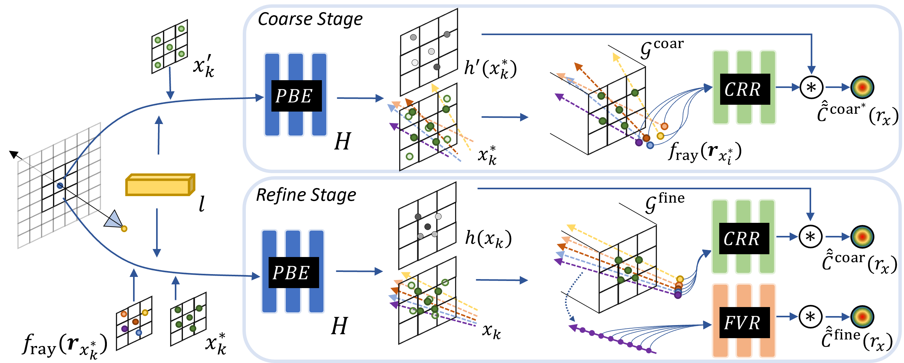
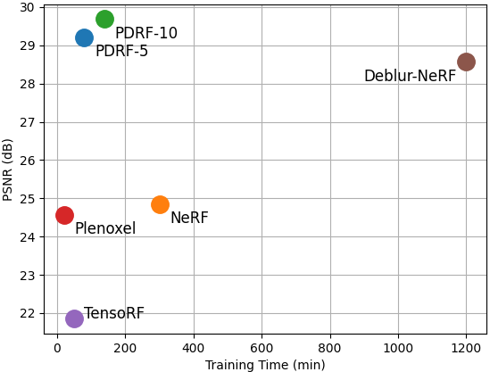

This is the official implementation of the paper [PDRF: Progressively Deblurring Radiance Field for Fast and Robust Scene
Reconstruction from Blurry Images](https://arxiv.org/abs/2208.08049)
# PDRF

## Method Overview
Progressively Deblurring Radiance Field (PDRF) is a novel approach to efficiently reconstruct high quality radiance fields from blurry images. Compared to previous methods like NeRF and DeblurNeRF, PDRF is both much faster and more performant by utilizing radiance field features to model blur. 


<p align="center">
  
</p>


## Quick Start

### 1. Install environment

```
pip install -r requirements.txt
```

### 2. Download dataset
We evaluate our results based on the dataset captured by [DeblurNeRF](https://arxiv.org/abs/2111.14292). You can download the data in [here](https://hkustconnect-my.sharepoint.com/:f:/g/personal/lmaag_connect_ust_hk/EqB3QrnNG5FMpGzENQq_hBMBSaCQiZXP7yGCVlBHIGuSVA?e=UaSQCC). 


### 3. Setting parameters in configs/

This codebase supports several configurations for radiance field modeling. Two parameters worth noting are ```args.mode={c2f,nerf}``` and ```args.kernel_type={none,DSK,PBE}```. Specifically, ```args.mode=c2f``` leads to our coarse-to-fine rendering architectures (CRR+FVR), which leverages explicit representation (implemented based on [TensoRF](https://arxiv.org/abs/2203.09517)) and an improved importance sampling scheme; ```args.mode=PBE``` is our two-stage blur-modeling design. DeblurNeRF can be implemented with ```args.mode=nerf,args.kernel_type=DSK```; you can also try any other combinations. 


### 4. Execute

```
python3 run_nerf.py --config configs/defocustanabata/tx_defocustanabata_full.txt
```

### 5. Visualize
To render a video on the learned scene:
```
python3 run_nerf.py --config configs/defocustanabata/tx_defocustanabata_full.txt --render_only
```

To render images on the learned scene:
```
python3 run_nerf.py --config configs/defocustanabata/tx_defocustanabata_full.txt --render_only --render_test
```


## Citation
If you find this useful, please consider citing our paper:
```
@misc{peng2023pdrf,
    title={PDRF: Progressively Deblurring Radiance Field for Fast and Robust Scene
Reconstruction from Blurry Images},
    author={Cheng, Peng and Rama, Chellappa},
    year={2023},
    booktitle = {The 37th AAAI Conference on Artificial Intelligence}
}
```

## Acknowledge
This source code is derived from multiple sources, in particular: [nerf-pytorch](https://github.com/yenchenlin/nerf-pytorch/), [Deblurnerf](https://github.com/limacv/Deblur-NeRF), [TensoRF](https://github.com/apchenstu/TensoRF), and [HashNeRF-pytorch](https://github.com/yashbhalgat/HashNeRF-pytorch). We thank the previous authors for their awesome and consistent implementations. 
